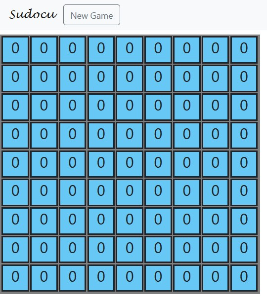
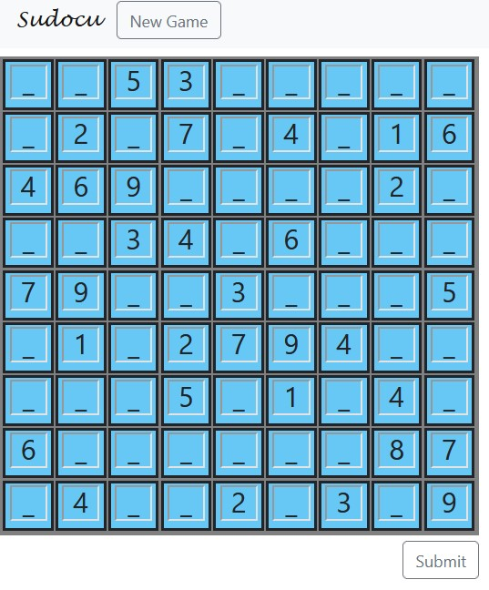
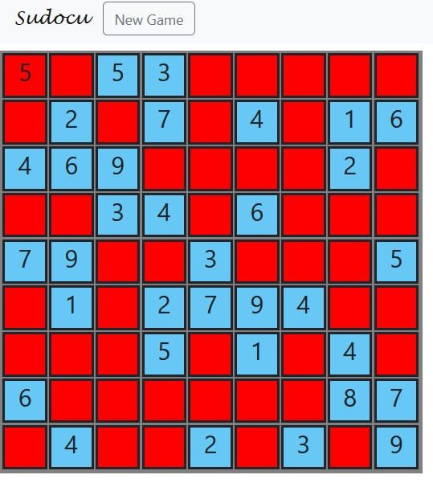

### Sudoku

The file sdk.py contains the impementation of algorithm X,
which is the solution of any sudoku grid.
It is accompanied my a .pdf file where the whole process is described.

The other files are for a site where from a database of 1.000.000 [sudokus](https://www.kaggle.com/bryanpark/sudoku).
First we create and populate the database(MySQL) with init_db.
Then we generate one randomly. Mistakes are shown after submition with red color, The solution is checked against algorithm X. For the site we used Flask,HTML,some Jinja syntax and JS.

